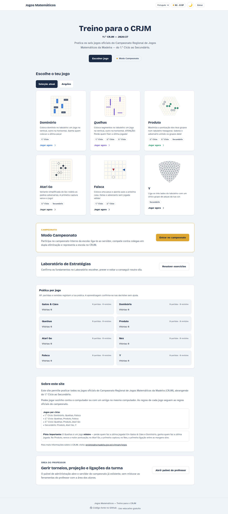

# Jogos Matemáticos - CRJM

Produto final de treino para o **Campeonato Regional de Jogos Matemáticos da Madeira** (CRJM).

A seleção por defeito é o **11.º CRJM — 2026/27**, com seis jogos atuais e dois no **Arquivo jogável**. Os oito jogos incluem modos locais, IA, torneios online, tutor, revisão, Laboratório e progresso persistente.



## Estado atual do produto

- **Jogos atuais:** Dominório, Faísca, Quelhas, Produto, Atari Go e Y
- **Arquivo jogável:** Gatos & Cães e Nex, com acesso explícito no início, no Laboratório e na criação de torneios. As ligações antigas e o progresso dos alunos mantêm-se.
- **Cobertura pedagógica nos oito jogos:** hints H1/H2/H3, contexto visual de turno, top jogadas e alertas de ameaça
- **Revisão e progresso:** quick review/turning point pós-jogo com XP, missões, conquistas e perfil persistido via bootstrap técnico de sessão no learner-core V1
- **Competição escolar:** modo campeonato com dupla eliminação e cliente/servidor dedicados
- **Estado técnico atual:** Dominório e Atari Go estão em nível de **piloto maduro**; Quelhas, Gatos & Cães, Produto e Nex estão **consolidados** segundo a matriz em [`docs/agents/ALL-GAMES-MATURITY-MATRIX.md`](docs/agents/ALL-GAMES-MATURITY-MATRIX.md)

### Jogos da edição atual — 11.º CRJM (2026/27)

| Jogo | Ciclos | Descrição |
|------|--------|-----------|
| 🁓 **Dominório** | 1.º | Coloca dominós no tabuleiro: um joga na vertical, outro na horizontal. Ganha quem colocar a última peça! |
| ➤ **Faísca** | 1.º, 2.º | Coloca na casa obrigatória e aponta para um destino vazio. Perde quem ficar sem jogada. |
| ▮ **Quelhas** | 1.º, 2.º, 3.º | Coloca segmentos no tabuleiro. **MISÈRE**: perde quem fizer a última jogada! |
| ✖️ **Produto** | 2.º, 3.º, Sec. | Maximiza a pontuação dos teus grupos num tabuleiro hexagonal. Sabota o adversário unindo os grupos dele! |
| ⚫⚪ **Atari Go** | 3.º, Sec. | Variante simplificada do Go. A primeira captura vence o jogo! |
| **Y** | Sec. | Liga os três lados com um único grupo. O segundo participante pode trocar de cores na primeira oportunidade. |

### Arquivo jogável

- **Gatos & Cães** — [ligação antiga](https://crjmai.infantinho.xyz/#/gatos-caes), modalidade anteriormente do 1.º ciclo.
- **Nex** — [ligação antiga](https://crjmai.infantinho.xyz/#/nex), modalidade anteriormente do secundário.

O perfil conserva os dados dos oito jogos, sem dividir ou reiniciar o progresso por edição. Faísca e Y têm dois níveis locais avaliados (N1 Explorar e N2 Antecipar), sem dependência de um serviço remoto de IA.

Evidência da atualização local: [verificação da issue #38](docs/agents/reviews/issue38-edition.md), [arena de Faísca](artifacts/faisca-arena/seed-3002026.json), [arena de Y](artifacts/y-arena/seed-3002026.json) e [conferência do tabuleiro de Y](docs/design/y-board-validation.md).

## Screenshots do produto

<table>
<tr>
<td width="50%">

**Gatos & Cães** (Arquivo)


</td>
<td width="50%">

**Dominório** (1.º Ciclo)


</td>
</tr>
<tr>
<td width="50%">

**Quelhas** (1.º-3.º Ciclo) - MISÈRE


</td>
<td width="50%">

**Produto** (2.º Ciclo - Secundário)


</td>
</tr>
<tr>
<td width="50%">

**Atari Go** (3.º Ciclo - Secundário)


</td>
<td width="50%">

**Nex** (Arquivo)


</td>
</tr>
</table>

## Modo Campeonato

Sistema de torneios online com dupla eliminação para competições escolares.


## Funcionalidades

- Jogar contra o **computador** (IA com heurísticas específicas para cada jogo)
- Jogar com **2 jogadores** no mesmo computador
- **Modo Campeonato**: Torneios online com sistema de dupla eliminação (suporta os **oito jogos**, atuais e arquivados)
- **Tutor visual por turno** com highlights no tabuleiro, contexto de leitura e top jogadas
- **Perfil do jogador** com XP, streak, missões, conquistas e barras de progresso por jogo
- **Caminhos de evolução** por jogo e revisão pós-jogo com recompensa
- Regras oficiais do CRJM
- Interface em **Português de Portugal** (PT-PT), **inglês** e **nepalês**
- Responsivo para computador, tablet e mobile

## Pedagogia

O produto foi afinado para servir treino real de campeonato, não apenas jogo livre.

- **Hints H1/H2/H3:** cada jogo usa três níveis de ajuda. H1 aponta o princípio a procurar, H2 orienta a decisão com mais contexto e H3 ajuda a destravar a posição sem transformar a dica num “resolver por ti”.
- **Leitura visual do turno:** a UI combina contexto textual com marcação visual da jogada recomendada, alternativas e respostas críticas diretamente no tabuleiro.
- **Aprendizagem por revisão:** no fim da partida, cada jogo regista um momento de revisão rápida — ou um turning point no Atari Go — para reforçar o raciocínio logo após a experiência.
- **Progressão observável:** XP, missões, achievements e caminhos de evolução dão continuidade ao treino entre sessões, em vez de cada jogo começar do zero.

## 🚀 Começar

### Pré-requisitos

- [Bun](https://bun.sh/) instalado no sistema
- *(Opcional, para compilar IA em WASM no build)* **Rust + cargo + rustup** e `wasm-bindgen` (o build tenta compilar e faz fallback para TypeScript se não estiver disponível)

### Instalação

```bash
# Clonar o repositório
git clone <url-do-repositorio>
cd crjm

# Instalar dependências
bun install
```

### Desenvolvimento

```bash
# Iniciar servidor de desenvolvimento com hot reload
bun run dev
```

O site estará disponível em `http://localhost:3000`.

Se precisares de mudar a porta:

```bash
PORT=3001 bun run dev
```

### Configuração opcional do bootstrap técnico do learner core V1

```bash
CRJM_LEARNER_DB_PATH=.data/learner-core-v1.sqlite
CRJM_SESSION_SECRET=dev-session-secret
CRJM_COOKIE_SECURE=false
```

Mantém `CRJM_COOKIE_SECURE=false` ao servir por HTTP numa rede local. Num domínio HTTPS atrás de proxy, define-o como `true`.

### Estado atual da autenticação no branch V1

- O learner-core atual usa **bootstrap técnico de sessão assinado por cookie** para suportar perfil/progresso persistido do aluno durante a transição do browser para backend.
- Isto **não** equivale ainda à integração final de auth recomendada em ADR-002.
- A identidade/autenticação de produção continua uma decisão de stack separada; o branch atual fecha apenas o **seam de sessão técnica + learner persistence** necessário para ADR-003 V1.

### Testes

```bash
# Executar testes unitários
bun test
```

### Produção (servidor Bun)

```bash
# Servir a app com Bun (NODE_ENV=production)
bun run start
```

### Build para produção

```bash
# Criar build estática
bun run build
```

Os ficheiros serão gerados na pasta `dist/`.

Notas sobre o build:
- O `build.ts` tenta compilar WASM para algumas IAs (ex.: Dominório/Quelhas/Produto). Se não tiveres toolchain Rust, o build continua com fallback TypeScript.
- Para desativar a parte de WASM: `bun run build -- --skip-wasm`

### Atualizar screenshots do README

As imagens em `docs/screenshots/` podem ser regeneradas com Playwright:

```bash
# Captura contra a app publicada no URL configurado em BASE_URL
bun run screenshots

# Captura contra uma instância local em http://localhost:3000
bun run screenshots:local
```

## Known Limitations

Resumo operacional atualizado a partir de [`docs/agents/ALL-GAMES-MATURITY-MATRIX.md`](docs/agents/ALL-GAMES-MATURITY-MATRIX.md):

- **Dominório N5>N4** e **Atari Go N4/N5**: o fallback TypeScript não garante ordering monotónico de topo; para esses níveis, a referência é build com WASM ativo no adapter V1.
- **T4 estabilidade (Dominório)**: repetição TS sem seed ainda diverge acima do alvo; é um artefacto conhecido da ausência de WASM na stack de topo.
- **Produto e Nex**: o fallback TS é heurístico; os níveis altos mantêm utilidade pedagógica, mas não equivalem à força do motor WASM.

## 🏆 Servidor de Torneios

O projeto inclui um servidor de torneios que permite organizar campeonatos online com sistema de dupla eliminação.

O servidor e a UI do modo campeonato suportam **os oito jogos**. A criação apresenta os seis jogos atuais e permite escolher o Arquivo:
- **Gatos & Cães** (Arquivo)
- **Faísca**
- **Y**
- **Dominório**
- **Quelhas**
- **Produto**
- **Atari Go**
- **Nex** (Arquivo)

### Iniciar o Servidor

```bash
# Iniciar servidor de torneios (o script prepara também os assets do modo espectador)
ADMIN_KEY=MUDA_PARA_UMA_CHAVE_FORTE bun run tournament

# Modo desenvolvimento (com hot reload, após gerar os assets do espectador)
ADMIN_KEY=MUDA_PARA_UMA_CHAVE_FORTE bun run tournament:dev
```

O servidor estará disponível em `http://localhost:4000` com:
- **WebSocket**: `ws://localhost:4000/ws` - Para ligações dos clientes
- **Painel Admin**: `http://localhost:4000/admin` - Para gerir o torneio (o browser pede utilizador `admin` + `ADMIN_KEY`)
- **API HTTP**: `http://localhost:4000/api/*` - Endpoints de administração
  - `GET /health` - Health check rápido

### Expor o Servidor Publicamente

Para que os alunos se possam ligar ao servidor, precisas de expor o servidor local usando um túnel:

#### Opção 1: ngrok (mais simples)

```bash
# Instalar ngrok: https://ngrok.com/download
ngrok http 4000
```

Irá gerar um URL como `https://abc123.ngrok.io` que podes partilhar com os alunos.

#### Opção 2: Cloudflare Tunnel (mais estável)

```bash
# Instalar cloudflared
# macOS:
brew install cloudflare/cloudflare/cloudflared

# Outros: https://developers.cloudflare.com/cloudflare-one/connections/connect-networks/downloads/

# Criar túnel
cloudflared tunnel --url http://localhost:4000
```

### Configuração

O servidor aceita variáveis de ambiente:

```bash
# Porta do servidor (default: 4000)
PORT=4000 bun run tournament

# Chave de administração (obrigatória)
ADMIN_KEY=MUDA_PARA_UMA_CHAVE_FORTE bun run tournament
```

### Guia Completo

Para um guia detalhado sobre como organizar um torneio, consulta o ficheiro [`TORNEIO.md`](./TORNEIO.md).

## 📦 Publicar no GitHub Pages

O workflow `.github/workflows/deploy.yml` executa testes e build completo com os cinco motores WASM nas pull requests e nos pushes para `main`. A publicação no GitHub Pages exige execução manual do workflow e só avança depois da validação passar.

### Opção 1: GitHub Actions (recomendado)

1. Ativar GitHub Pages nas definições do repositório (Source: **GitHub Actions**)
2. Em **Actions**, abrir **Validate and deploy to GitHub Pages** e escolher **Run workflow** (`workflow_dispatch`) na referência que se pretende publicar. Pushes e merges em `main` apenas validam; não publicam.

### Opção 2: Manualmente

1. Executar `bun run build`
2. Publicar a pasta `dist/` num hosting estático (GitHub Pages, Netlify, Cloudflare Pages, etc.)

> **Nota importante:** esta publicação estática é útil para treino local/offline e preview. A versão com servidor Bun, progresso persistido e operação completa para alunos/professor deve seguir um deployment VPS + Cloudflare.

### Painel de administração

- O painel do professor para campeonatos existe no **servidor de torneios** em `/admin`
- O modo espectador existe em `/admin/spectator`
- A app principal inclui uma entrada para abrir estes painéis sem reimplementar a lógica do servidor

### Guia de produção com VPS + Cloudflare

Para publicar uma versão funcional para alunos com Bun, SQLite persistente, painel de administração e Cloudflare, consulta:

- [`docs/deployment/vps-cloudflare-bun.md`](./docs/deployment/vps-cloudflare-bun.md)
- [`docs/deployment/servidor-casa-crjmai.md`](./docs/deployment/servidor-casa-crjmai.md) — deployment atual em `crjmai.infantinho.xyz`

## 🖥️ Produção no servidor de casa

A instalação principal é servida diretamente pelo servidor `ubuntusala`, não
pelo GitHub Pages:

- `crjmai.infantinho.xyz` → app Bun (SPA + learner-core/SQLite + proxy de IA), porta 3100;
- `crjmai-torneio.infantinho.xyz` → servidor WebSocket/admin de torneios, porta 4000;
- `127.0.0.1:8100` → serviço FastAPI/PyTorch da IA N6 do Atari Go, acessível apenas através do proxy da app.

Os processos Bun são unidades `systemd --user`; os serviços de inferência são
contentores Docker com arranque manual (`--restart no`); o túnel Cloudflare é
gerido pelo serviço systemd existente desta máquina.

## 🧠 IA e treino na RTX 5070 Ti

- Os cinco motores Rust/WASM continuam disponíveis offline e são compilados no build de produção.
- O Nex recebeu TT Zobrist, iterative deepening, move ordering e gestão de tempo; o duelo release reproduzido obteve 82% contra o motor anterior (41/50, zero overshoot).
- O Produto ganhou uma arena WASM-vs-TS com aberturas emparelhadas e seed fixa: no budget real de N5 (2 s), o WASM obteve 7/10, zero ilegais e p95 2000,49 ms; a amostra ainda é pequena e, a 100/500 ms, ficou em 40%.
- O Atari Go tem um pipeline AlphaZero em `training/atari_go/`: regras numpy validadas contra 500 jogos/23 746 plies das regras TypeScript (0 divergências), rede residual de ~468 mil parâmetros, MCTS PUCT, self-play e gating.
- Treino `az-v1`: 30 iterações, 60 000 jogos de self-play concluídos, 22 promoções; policy loss 4,2829 → 2,1394.
- O nível **N6 · Mestre** usa a rede no servidor/GPU; após corrigir o deadline do N5, a arena emparelhada obteve 92% contra o N5 Rust/WASM (46/50), zero ilegais, p95 N6 332 ms e p95 N5 500 ms num budget de 500 ms. Se o serviço estiver indisponível, ocupado ou limitado, cai silenciosamente para N5 WASM/TypeScript.
- Comandos de treino, serviço e arena: [`training/README.md`](./training/README.md).
- Estado auditado e próximos gates: [`docs/agents/AI-TRAINING-STATUS-2026-07-18.md`](./docs/agents/AI-TRAINING-STATUS-2026-07-18.md).

## 📜 Regras dos Jogos

As regras completas de cada jogo estão disponíveis no site oficial do CRJM:
- [Regras oficiais do CRJM](https://projetosdre.madeira.gov.pt/crjmram/jogos/)

## 🛠️ Tecnologias

- [React 19](https://react.dev/) - Biblioteca de UI
- [TypeScript](https://www.typescriptlang.org/) - Tipagem estática
- [Tailwind CSS 4](https://tailwindcss.com/) - Estilos
- [Bun](https://bun.sh/) - Runtime, bundler e gestor de pacotes

## 📁 Estrutura do Projeto

```
build.ts                # Script de build (inclui passos de WASM + workers)
src/
├── components/           # Componentes de UI reutilizáveis
│   ├── GameCard.tsx
│   ├── GameLayout.tsx
│   ├── Header.tsx
│   ├── PlayerInfo.tsx
│   ├── RulesPanel.tsx
│   └── WinnerAnnouncement.tsx
├── games/
│   ├── gatos-caes/       # Gatos & Cães (Arquivo)
│   │   ├── types.ts
│   │   ├── logic.ts
│   │   ├── logic.test.ts
│   │   └── GatosCaesGame.tsx
│   ├── dominorio/        # Jogo Dominório (1.º Ciclo)
│   │   ├── types.ts
│   │   ├── logic.ts
│   │   ├── logic.test.ts
│   │   └── DominorioGame.tsx
│   ├── quelhas/          # Jogo Quelhas (1.º, 2.º, 3.º Ciclo) - MISÈRE
│   │   ├── types.ts
│   │   ├── logic.ts
│   │   ├── logic.test.ts
│   │   └── QuelhasGame.tsx
│   ├── produto/          # Jogo Produto (2.º, 3.º Ciclo, Secundário)
│   │   ├── types.ts
│   │   ├── logic.ts
│   │   ├── logic.test.ts
│   │   └── ProdutoGame.tsx
│   ├── atari-go/         # Atari Go (3.º Ciclo, Secundário)
│   │   ├── types.ts
│   │   ├── logic.ts
│   │   ├── logic.test.ts
│   │   └── AtariGoGame.tsx
│   ├── faisca/           # Faísca (1.º, 2.º Ciclo), regras e IA local
│   ├── y/                # Y (Secundário), grafo oficial e IA local
│   └── nex/              # Nex (Arquivo)
│       ├── types.ts
│       ├── logic.ts
│       ├── logic.test.ts
│       └── NexGame.tsx
├── server/               # Servidor de torneios
│   ├── tournament-server.ts  # Servidor WebSocket principal
│   ├── tournament-engine.ts  # Motor de dupla eliminação
│   ├── game-adapter.ts        # Adaptador para estados dos jogos
│   └── admin-page.ts          # Interface de administração
├── tournament/           # Cliente de torneios
│   ├── TournamentClient.ts         # Interface do cliente
│   ├── TournamentWebSocketClient.ts # Cliente WebSocket real
│   ├── TournamentClientMock.ts     # Cliente mock para testes
│   ├── protocol.ts                 # Protocolo de comunicação
│   ├── game-protocol.ts            # Protocolo específico dos jogos
│   └── GameBoards.tsx              # Componentes de tabuleiro online
├── types/                # Tipos TypeScript comuns
├── App.tsx               # Componente principal
├── frontend.tsx          # Entrada React
├── index.html            # HTML base
└── index.css             # Estilos globais
wasm/                   # Crates Rust para IA (WASM)
```

## 📝 Licença

Este projeto está licenciado para **uso educativo gratuito**.

**Uso permitido:**
- ✅ Escolas e instituições de ensino
- ✅ Professores e educadores
- ✅ Alunos para treino e competições
- ✅ Campeonatos escolares de jogos matemáticos

**Uso proibido:**
- ❌ Venda ou comercialização
- ❌ Utilização comercial

Consulta o ficheiro [LICENSE](./LICENSE) para os termos completos.

## 🔗 Links

- **Código fonte**: [github.com/atilasos/crjm](https://github.com/atilasos/crjm)
- **Regras oficiais CRJM**: [projetosdre.madeira.gov.pt/crjmram](https://projetosdre.madeira.gov.pt/crjmram/jogos/)

---

🎓 Bom treino e boa sorte no campeonato!

<sub>Desenvolvido com ❤️ para o Campeonato Regional de Jogos Matemáticos da Madeira • [GitHub](https://github.com/atilasos/crjm)</sub>
