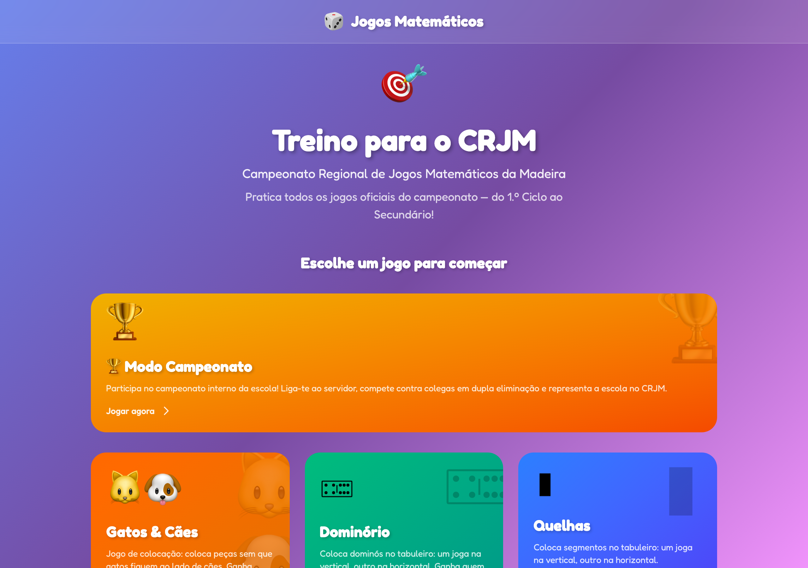
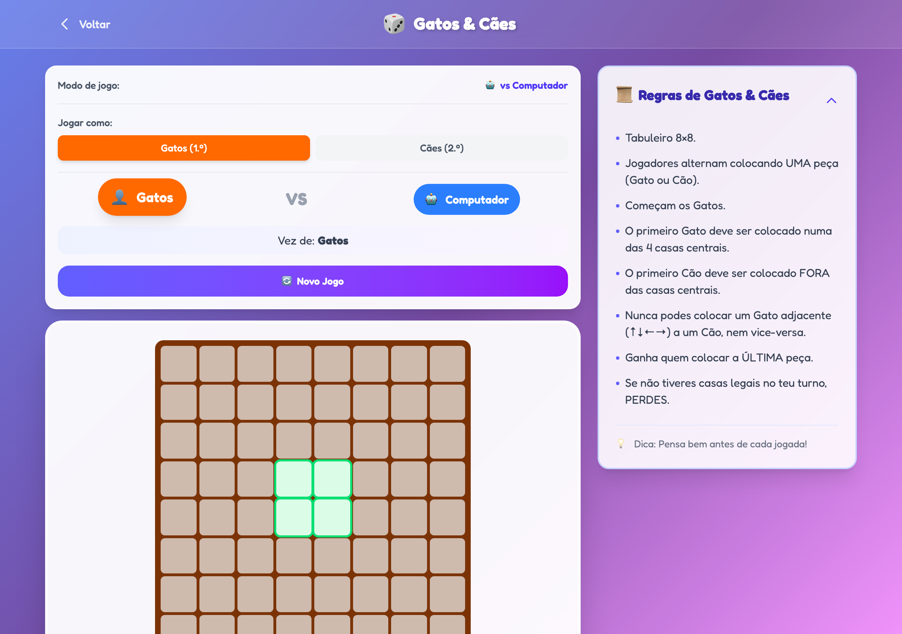
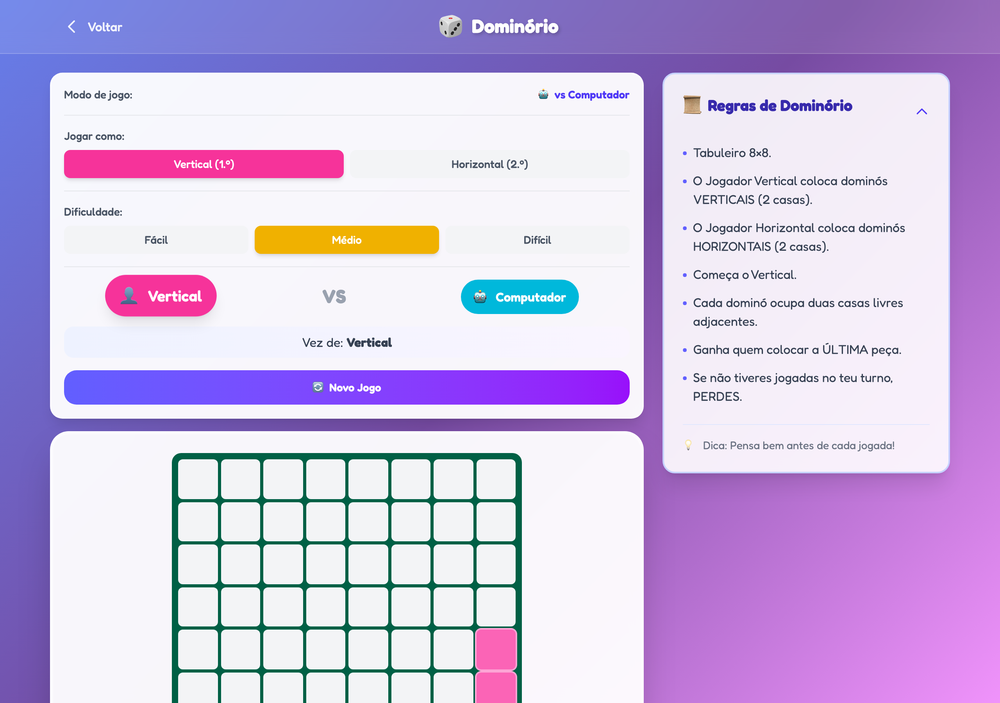
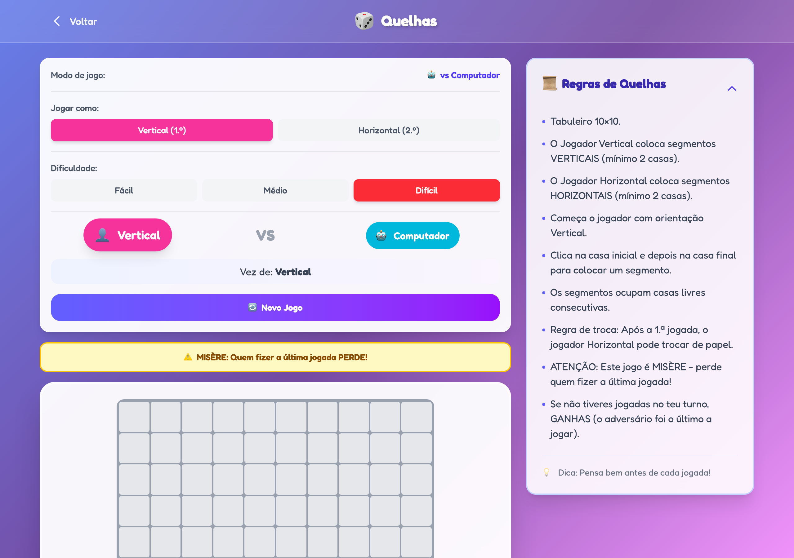
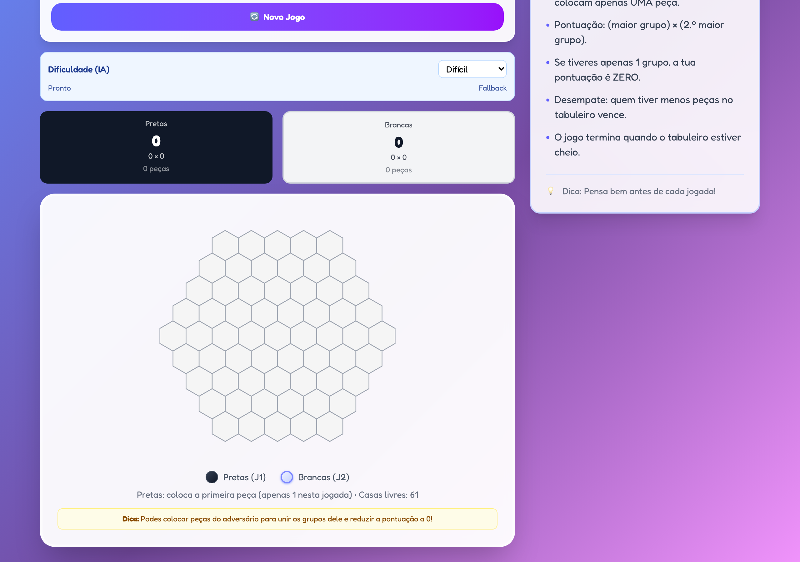
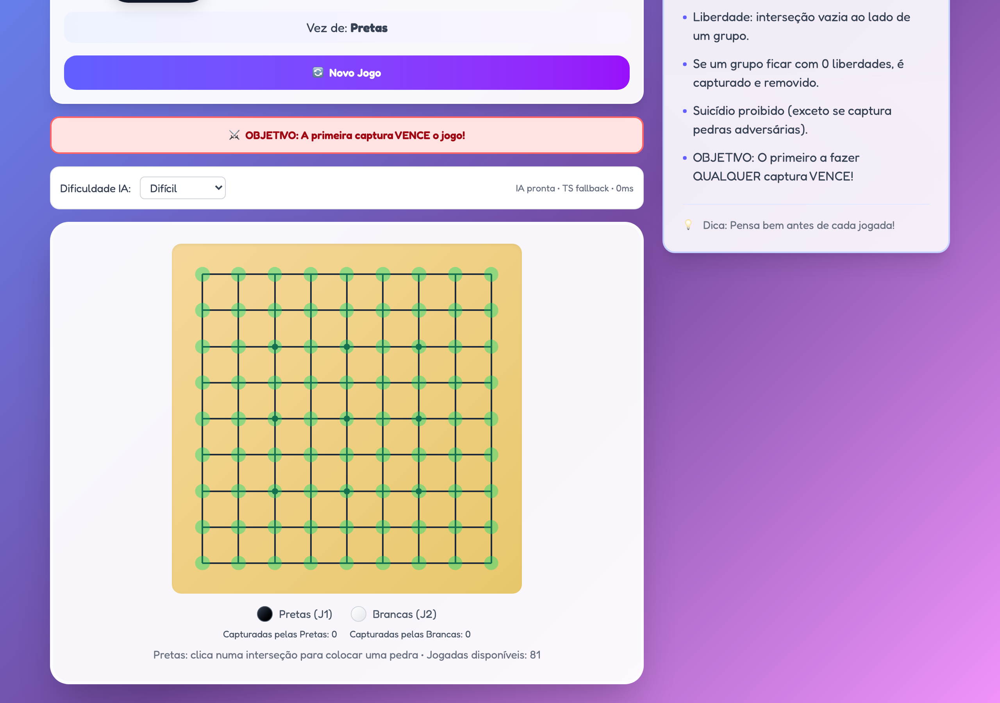
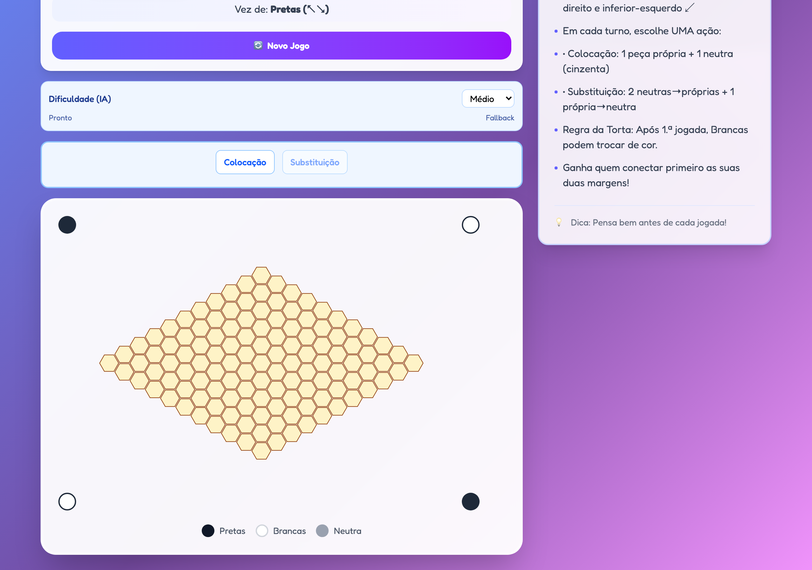
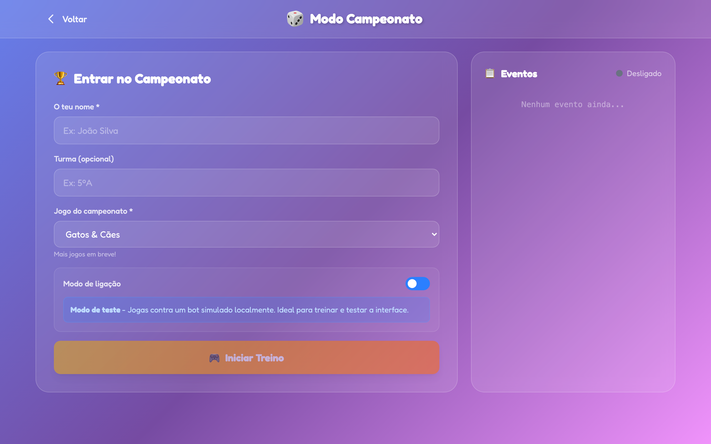

# Jogos Matemáticos - CRJM

Site de treino para o **Campeonato Regional de Jogos Matemáticos da Madeira** (CRJM).

Este projeto contém todos os **6 jogos oficiais** do campeonato, abrangendo do **1.º Ciclo ao Secundário**.



### Jogos disponíveis

| Jogo | Ciclos | Descrição |
|------|--------|-----------|
| 🐱🐶 **Gatos & Cães** | 1.º | Coloca peças sem que gatos fiquem ao lado de cães. Ganha quem fizer a última jogada! |
| 🁓 **Dominório** | 1.º, 2.º | Coloca dominós no tabuleiro: um joga na vertical, outro na horizontal. Ganha quem colocar a última peça! |
| ▮ **Quelhas** | 1.º, 2.º, 3.º | Coloca segmentos no tabuleiro. **MISÈRE**: perde quem fizer a última jogada! |
| ✖️ **Produto** | 2.º, 3.º, Sec. | Maximiza a pontuação dos teus grupos num tabuleiro hexagonal. Sabota o adversário unindo os grupos dele! |
| ⚫⚪ **Atari Go** | 3.º, Sec. | Variante simplificada do Go. A primeira captura vence o jogo! |
| 🔗 **Nex** | Sec. | Jogo de conexão com peças neutras. Liga as tuas margens opostas antes do adversário! |

## Exemplos dos Jogos

<table>
<tr>
<td width="50%">

**Gatos & Cães** (1.º Ciclo)



</td>
<td width="50%">

**Dominório** (1.º, 2.º Ciclo)



</td>
</tr>
<tr>
<td width="50%">

**Quelhas** (1.º-3.º Ciclo) - MISÈRE



</td>
<td width="50%">

**Produto** (2.º Ciclo - Secundário)



</td>
</tr>
<tr>
<td width="50%">

**Atari Go** (3.º Ciclo - Secundário)



</td>
<td width="50%">

**Nex** (Secundário)



</td>
</tr>
</table>

## Modo Campeonato

Sistema de torneios online com dupla eliminação para competições escolares.



## Funcionalidades

- Jogar contra o **computador** (IA com heurísticas específicas para cada jogo)
- Jogar com **2 jogadores** no mesmo computador
- **Modo Campeonato**: Torneios online com sistema de dupla eliminação (suporta os **6 jogos oficiais**)
- Regras oficiais do CRJM
- Interface em **Português de Portugal** (PT-PT)
- Totalmente responsivo (funciona em computador e tablet)

## 🚀 Começar

### Pré-requisitos

- [Bun](https://bun.sh/) instalado no sistema
- *(Opcional, para compilar IA em WASM no build)* **Rust + cargo + rustup** e `wasm-bindgen` (o build tenta compilar e faz fallback para TypeScript se não estiver disponível)

### Instalação

```bash
# Clonar o repositório
git clone <url-do-repositorio>
cd crjm

# Instalar dependências
bun install
```

### Desenvolvimento

```bash
# Iniciar servidor de desenvolvimento com hot reload
bun run dev
```

O site estará disponível em `http://localhost:3000`.

Se precisares de mudar a porta:

```bash
PORT=3001 bun run dev
```

### Testes

```bash
# Executar testes unitários
bun test
```

### Produção (servidor Bun)

```bash
# Servir a app com Bun (NODE_ENV=production)
bun run start
```

### Build para produção

```bash
# Criar build estática
bun run build
```

Os ficheiros serão gerados na pasta `dist/`.

Notas sobre o build:
- O `build.ts` tenta compilar WASM para algumas IAs (ex.: Dominório/Quelhas/Produto). Se não tiveres toolchain Rust, o build continua com fallback TypeScript.
- Para desativar a parte de WASM: `bun run build -- --skip-wasm`

### Atualizar screenshots do README

As imagens em `docs/screenshots/` podem ser regeneradas com Playwright:

```bash
# Captura contra a app publicada no URL configurado em BASE_URL
bun run screenshots

# Captura contra uma instância local em http://localhost:3000
bun run screenshots:local
```

## Known Limitations

Resumo operacional atualizado a partir de [`docs/agents/ALL-GAMES-MATURITY-MATRIX.md`](docs/agents/ALL-GAMES-MATURITY-MATRIX.md):

- **Dominório N5>N4** e **Atari Go N4/N5**: o fallback TypeScript não garante ordering monotónico de topo; para esses níveis, a referência é build com WASM ativo no adapter V1.
- **T4 estabilidade (Dominório)**: repetição TS sem seed ainda diverge acima do alvo; é um artefacto conhecido da ausência de WASM na stack de topo.
- **Produto e Nex**: o fallback TS é heurístico; os níveis altos mantêm utilidade pedagógica, mas não equivalem à força do motor WASM.

## 🏆 Servidor de Torneios

O projeto inclui um servidor de torneios que permite organizar campeonatos online com sistema de dupla eliminação.

Atualmente, o servidor e a UI do modo campeonato suportam **todos os 6 jogos**:
- **Gatos & Cães**
- **Dominório**
- **Quelhas**
- **Produto**
- **Atari Go**
- **Nex**

### Iniciar o Servidor

```bash
# Iniciar servidor de torneios
bun run tournament

# Modo desenvolvimento (com hot reload)
bun run tournament:dev
```

O servidor estará disponível em `http://localhost:4000` com:
- **WebSocket**: `ws://localhost:4000/ws` - Para ligações dos clientes
- **Painel Admin**: `http://localhost:4000/admin` - Para gerir o torneio
- **API HTTP**: `http://localhost:4000/api/*` - Endpoints de administração
  - `GET /health` - Health check rápido

### Expor o Servidor Publicamente

Para que os alunos se possam ligar ao servidor, precisas de expor o servidor local usando um túnel:

#### Opção 1: ngrok (mais simples)

```bash
# Instalar ngrok: https://ngrok.com/download
ngrok http 4000
```

Irá gerar um URL como `https://abc123.ngrok.io` que podes partilhar com os alunos.

#### Opção 2: Cloudflare Tunnel (mais estável)

```bash
# Instalar cloudflared
# macOS:
brew install cloudflare/cloudflare/cloudflared

# Outros: https://developers.cloudflare.com/cloudflare-one/connections/connect-networks/downloads/

# Criar túnel
cloudflared tunnel --url http://localhost:4000
```

### Configuração

O servidor aceita variáveis de ambiente:

```bash
# Porta do servidor (default: 4000)
PORT=4000 bun run tournament

# Chave de administração (default: admin123)
ADMIN_KEY=minha-chave-secreta bun run tournament
```

### Guia Completo

Para um guia detalhado sobre como organizar um torneio, consulta o ficheiro [`TORNEIO.md`](./TORNEIO.md).

## 📦 Publicar no GitHub Pages

Este repositório já inclui um workflow em `.github/workflows/deploy.yml` que faz build e publica para GitHub Pages.

### Opção 1: GitHub Actions (recomendado)

1. Ativar GitHub Pages nas definições do repositório (Source: **GitHub Actions**)
2. Fazer push para `main` (ou correr manualmente via `workflow_dispatch`)

### Opção 2: Manualmente

1. Executar `bun run build`
2. Publicar a pasta `dist/` num hosting estático (GitHub Pages, Netlify, Cloudflare Pages, etc.)

## 📜 Regras dos Jogos

As regras completas de cada jogo estão disponíveis no site oficial do CRJM:
- [Regras oficiais do CRJM](https://projetosdre.madeira.gov.pt/crjmram/jogos/)

## 🛠️ Tecnologias

- [React 19](https://react.dev/) - Biblioteca de UI
- [TypeScript](https://www.typescriptlang.org/) - Tipagem estática
- [Tailwind CSS 4](https://tailwindcss.com/) - Estilos
- [Bun](https://bun.sh/) - Runtime, bundler e gestor de pacotes

## 📁 Estrutura do Projeto

```
build.ts                # Script de build (inclui passos de WASM + workers)
src/
├── components/           # Componentes de UI reutilizáveis
│   ├── GameCard.tsx
│   ├── GameLayout.tsx
│   ├── Header.tsx
│   ├── PlayerInfo.tsx
│   ├── RulesPanel.tsx
│   └── WinnerAnnouncement.tsx
├── games/
│   ├── gatos-caes/       # Jogo Gatos & Cães (1.º Ciclo)
│   │   ├── types.ts
│   │   ├── logic.ts
│   │   ├── logic.test.ts
│   │   └── GatosCaesGame.tsx
│   ├── dominorio/        # Jogo Dominório (1.º, 2.º Ciclo)
│   │   ├── types.ts
│   │   ├── logic.ts
│   │   ├── logic.test.ts
│   │   └── DominorioGame.tsx
│   ├── quelhas/          # Jogo Quelhas (1.º, 2.º, 3.º Ciclo) - MISÈRE
│   │   ├── types.ts
│   │   ├── logic.ts
│   │   ├── logic.test.ts
│   │   └── QuelhasGame.tsx
│   ├── produto/          # Jogo Produto (2.º, 3.º Ciclo, Secundário)
│   │   ├── types.ts
│   │   ├── logic.ts
│   │   ├── logic.test.ts
│   │   └── ProdutoGame.tsx
│   ├── atari-go/         # Atari Go (3.º Ciclo, Secundário)
│   │   ├── types.ts
│   │   ├── logic.ts
│   │   ├── logic.test.ts
│   │   └── AtariGoGame.tsx
│   └── nex/              # Jogo Nex (Secundário)
│       ├── types.ts
│       ├── logic.ts
│       ├── logic.test.ts
│       └── NexGame.tsx
├── server/               # Servidor de torneios
│   ├── tournament-server.ts  # Servidor WebSocket principal
│   ├── tournament-engine.ts  # Motor de dupla eliminação
│   ├── game-adapter.ts        # Adaptador para estados dos jogos
│   └── admin-page.ts          # Interface de administração
├── tournament/           # Cliente de torneios
│   ├── TournamentClient.ts         # Interface do cliente
│   ├── TournamentWebSocketClient.ts # Cliente WebSocket real
│   ├── TournamentClientMock.ts     # Cliente mock para testes
│   ├── protocol.ts                 # Protocolo de comunicação
│   ├── game-protocol.ts            # Protocolo específico dos jogos
│   └── GameBoards.tsx              # Componentes de tabuleiro online
├── types/                # Tipos TypeScript comuns
├── App.tsx               # Componente principal
├── frontend.tsx          # Entrada React
├── index.html            # HTML base
└── index.css             # Estilos globais
wasm/                   # Crates Rust para IA (WASM)
```

## 📝 Licença

Este projeto está licenciado para **uso educativo gratuito**.

**Uso permitido:**
- ✅ Escolas e instituições de ensino
- ✅ Professores e educadores
- ✅ Alunos para treino e competições
- ✅ Campeonatos escolares de jogos matemáticos

**Uso proibido:**
- ❌ Venda ou comercialização
- ❌ Utilização comercial

Consulta o ficheiro [LICENSE](./LICENSE) para os termos completos.

## 🔗 Links

- **Código fonte**: [github.com/atilasos/crjm](https://github.com/atilasos/crjm)
- **Regras oficiais CRJM**: [projetosdre.madeira.gov.pt/crjmram](https://projetosdre.madeira.gov.pt/crjmram/jogos/)

---

🎓 Bom treino e boa sorte no campeonato!

<sub>Desenvolvido com ❤️ para o Campeonato Regional de Jogos Matemáticos da Madeira • [GitHub](https://github.com/atilasos/crjm)</sub>
